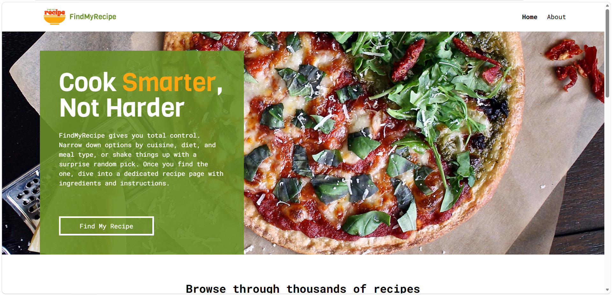

# FindMyRecipe

FindMyRecipe is a recipe discovery web app built with React, TypeScript, and Vite, powered by TheMealDB API. Search for recipes by name, browse detailed step-by-step instructions, or let the "Surprise me!" feature pick a random dish.



**[Live Demo](https://findmyrecipe-recipe-finder.vercel.app/)** · **[Figma Design](https://www.figma.com/design/gN9YX2ZG0X9LBF65hY825I/FindMyRecipe)**

## Features

- **Search by Name** - find recipes instantly with a live search against TheMealDB
- **Surprise Me!** - get a random recipe pulled from thousands of dishes, with duplicate-free multi-fetch logic for the homepage's featured picks
- **Detailed Recipe Pages** - ingredients, area/cuisine, step-by-step instructions, and an embedded YouTube tutorial
- **Pagination** - browse search results 9 at a time with a responsive page control
- **Typed, End-to-End** - strict TypeScript throughout, including generics for reusable API/hook logic

## Tech / Tools

- React + TypeScript
- Vite
- Tailwind CSS (with custom theme tokens and utilities)
- React Router
- TheMealDB API
- Node.js (tooling — ESLint/Prettier via npm)

## Setup

### Prerequisites

Node.js and npm installed.

### Installation

```bash
git clone git@github.com:jagonosalexandra/findmyrecipe-recipe-finder.git
cd findmyrecipe-recipe-finder
npm install
```

### Usage

```bash
npm run dev
```

Then open the local URL shown in your terminal in your browser.
